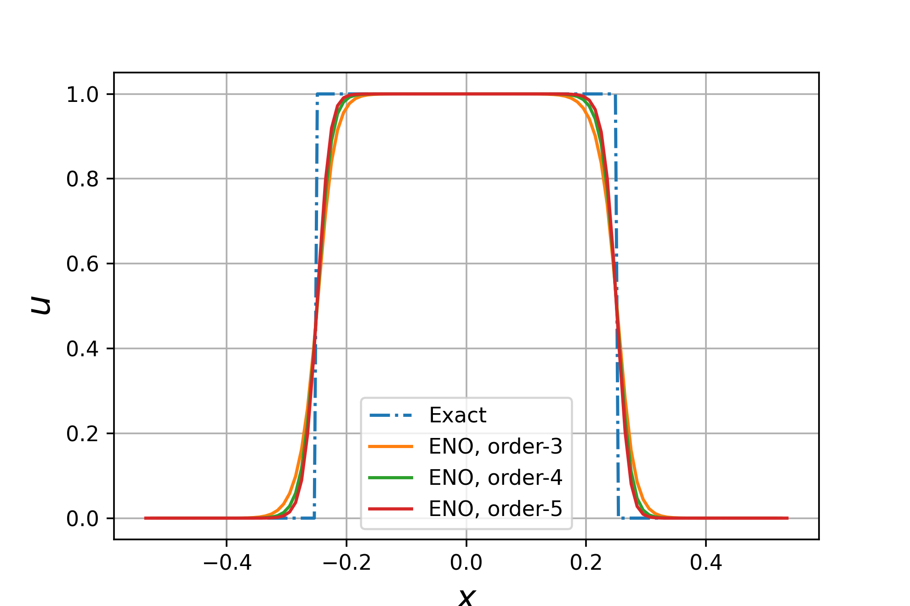

# ENO scheme for 1-D linear advection equation

k-th order ENO scheme for 1-D linear advection equation is implemented in `ENO.py`. The problem is solved by intereacting with the `ENO` class. The construction function of the `ENO` class contains the following arguments:

```
a: The convection speed, default value is 1
ni: The number of internal cells, default value is 100
cfl: The CFL number used for simulation, default value is 0.5
order: The order of ENO scheme used, default value is 3
```

To use the code, simply write:

```python
import numpy as np
import ENO as ENO

eno = ENO.ENO_advection(order=3) # set order to the order you need
eno.set_initial()
global_t = 0.0
T = 10.0 # simulate to T = 10.0
global_t = 0.0
while global_t < T:
    dt = eno.Runge_Kutta()
    global_t += dt
```

And you can use the following command to plot the result:

```python
import matplotlib.pyplot as plt
plt.plot(eno.xc, eno.u, label = "ENO, order-{}".format(3))
```

For the more detailed usage, you can refer to `test.ipynb`. The plot of the solution given by ENO 3, 4, and 5 at T = 1.0, a = 1.0 is shown below:



The GIF below compares the numerical solution of ENO-3 with the exact solution when the solution time T < 10:


